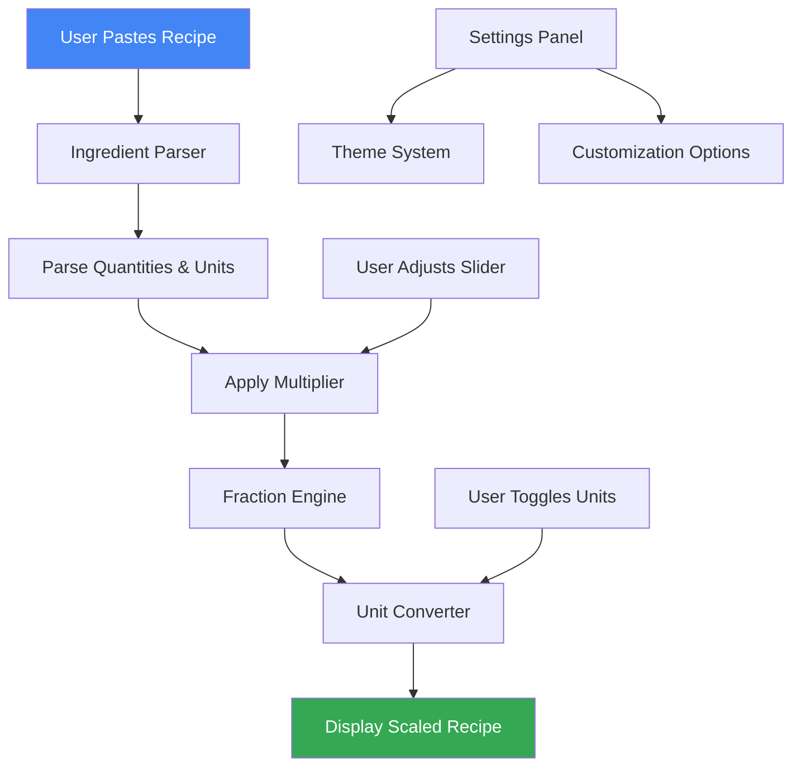
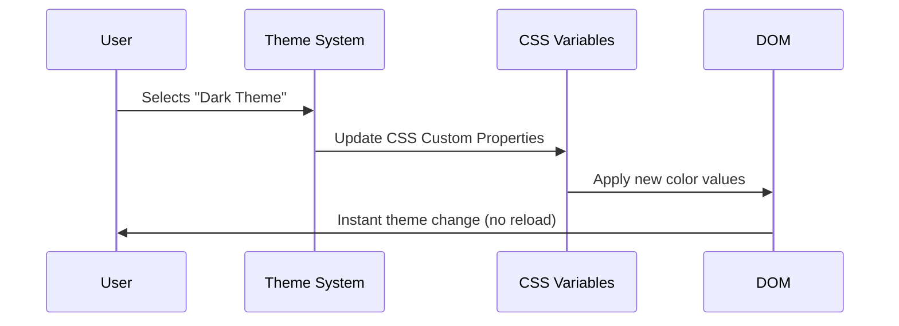
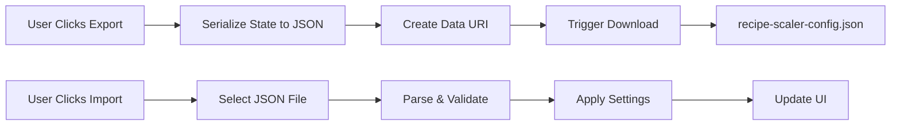

# 🥘 RecipeScaler

<div align="center">

[](https://aliriyaj007.github.io/RecipeScaler/)
[](LICENSE)
[](https://github.com/Aliriyaj007/RecipeScaler)
[](https://github.com/Aliriyaj007/RecipeScaler/blob/main/recipe-scaler.html)
[](https://developer.mozilla.org/en-US/docs/Web/JavaScript)
[](https://github.com/Aliriyaj007/RecipeScaler/stargazers)

**Precision recipe scaling for home cooks, bakers, and meal preppers. No math required.**

[Get Started](#-60-second-quick-start) • [Features](#-features) • [Live Demo](https://aliriyaj007.github.io/RecipeScaler/) • [Download](#-installation)

</div>

---

## 📖 What is RecipeScaler?

**RecipeScaler** is a zero-dependency, client-side web application that instantly adjusts cooking recipes for any number of servings. Paste any recipe, drag a slider, and get perfectly scaled ingredient amounts—without manual calculations or guesswork.

### Why This Tool Exists

| Problem | Solution |
|---------|----------|
| Cooking for 2 but recipes serve 8? | Scale down to 0.25x with one click |
| Meal prepping for the week? | Scale up to 4x instantly |
| Converting cups to grams? | Toggle between Imperial/Metric |
| Math errors ruining recipes? | Precise fraction handling |
| Different pan sizes needed? | Built-in pan calculator |

**Before RecipeScaler:**
```
Original: 2 cups flour (serves 8)
For 2 people: (2 ÷ 8 × 2) = 0.5 cups
Wait, that's ½ cup... or 4 oz? Or 113g?
Let me find my calculator...
```

**After RecipeScaler:**
```
Paste recipe → Drag to 0.25x → "½ cup flour (57g)"
Done. No math. No errors.
```

---

## 🚀 60-Second Quick Start

### Method 1: Live Demo (Fastest)
1. Visit **[https://aliriyaj007.github.io/RecipeScaler/](https://aliriyaj007.github.io/RecipeScaler/)**
2. Paste any recipe in the left panel
3. Drag the slider to adjust servings
4. Done. That's it.

### Method 2: Local Download
```bash
# Download the single HTML file
curl -O https://raw.githubusercontent.com/Aliriyaj007/RecipeScaler/main/recipe-scaler.html

# Or with wget
wget https://raw.githubusercontent.com/Aliriyaj007/RecipeScaler/main/recipe-scaler.html

# Open in any browser
open recipe-scaler.html  # macOS
start recipe-scaler.html # Windows
xdg-open recipe-scaler.html # Linux
```

### Method 3: Git Clone
```bash
git clone https://github.com/Aliriyaj007/RecipeScaler.git
cd RecipeScaler
open recipe-scaler.html
```

**No installation.** **No dependencies.** **No accounts.** Just open and use.

---

## ⚙️ How It Works

### Application Architecture



### Core Parsing Logic
```javascript
// Pattern recognition for ingredient parsing
const patterns = [
    /^(\d+(?:\s+\d+\/\d+)?)\s+([a-zA-Z]+)\s+(.+)/,  // "1 1/2 cups flour"
    /^(\d+\/\d+)\s+([a-zA-Z]+)\s+(.+)/,             // "1/2 cup flour"
    /^(\d+)\s+(.+)/,                                 // "3 eggs"
    /^([a-zA-Z]+)\s+(.+)/,                           // "Pinch of salt"
];
```

### Fraction Handling
```javascript
// Converts decimals to readable fractions
0.125 → ⅛
0.25  → ¼
0.333 → ⅓
0.5   → ½
0.75  → ¾
1.5   → 1 ½
```

---

## ✨ Features

### ✅ Basic Features (Core Functionality)
| Feature | Description | Example Input → Output |
|---------|-------------|------------------------|
| **Recipe Parsing** | Auto-detects quantities and units | `"2 cups flour"` → `{amount: 2, unit: cups, ingredient: flour}` |
| **Real-time Scaling** | Instant updates as you adjust | `Slider: 2x` → `"2 cups"` → `"4 cups"` |
| **Fraction Support** | Handles mixed numbers and fractions | `"1 1/2 tsp" × 2` → `"3 tsp"` |
| **Copy to Clipboard** | One-click copy of scaled recipe | Click → `Copied to clipboard!` |

### 🚀 Enhanced Features (Power User)
| Feature | Description | Use Case |
|---------|-------------|----------|
| **Unit Conversion** | Imperial ↔ Metric toggle | Cups → Grams, Ounces → Milliliters |
| **Custom Multipliers** | Enter exact scaling factors | `3.75x` for specific serving counts |
| **Preset Scaling** | Common presets (½, 2x, 4x) | One-click adjustments |
| **Print & Export** | Formatted print output | Kitchen-friendly printouts |
| **Shopping List** | Consolidated ingredient list | Grocery shopping made easy |

### 🔥 Advanced Features (Professional)
| Feature | Description | Technical Implementation |
|---------|-------------|--------------------------|
| **7 Premium Themes** | Light, Dark, Midnight, Emerald, Sunset, Minimal, Custom | CSS Custom Properties |
| **Pan Size Calculator** | Adjusts baking pan dimensions | Area-based scaling algorithm |
| **Equipment Notes** | Suggests tool adjustments | Volume threshold detection |
| **Import/Export Config** | Save all settings to JSON | Client-side file API |
| **Custom Settings** | Toggle behaviors and displays | Local state management |

---

## 🎨 Theming System

### Available Themes
| Theme | Primary Color | Best For | Preview |
|-------|---------------|----------|---------|
| **Light** | Google Blue (#4285F4) | Daytime use, readability |  |
| **Dark** | OLED Black (#0F0F0F) | Night cooking, eye comfort |  |
| **Midnight Blue** | Navy Blue (#0A2647) | Focused cooking sessions |  |
| **Emerald Green** | Forest Green (#065F46) | Baking, natural lighting |  |
| **Sunset Gradient** | Orange-Red (#EA580C) | Evening meal prep |  |
| **Minimal Gray** | Neutral Gray (#6B7280) | Distraction-free use |  |
| **Custom** | User-defined | Personal preference |  |

**Theme Switching Flow:**


---

## 📁 Project Structure

```
RecipeScaler/
├── recipe-scaler.html          # Single-file application
├── README.md                   # This documentation
├── LICENSE                     # MIT License
└── .github/
    └── workflows/
        └── deploy.yml          # GitHub Pages deployment
```

### Single-File Architecture
```html
<!DOCTYPE html>
<html>
<head>
    <!-- 1. All CSS in one <style> block -->
    <style>
        :root { /* CSS Variables for theming */ }
        /* All component styles */
    </style>
</head>
<body>
    <!-- 2. All HTML structure -->
    <div class="container">...</div>
    
    <!-- 3. All JavaScript in one <script> block -->
    <script>
        (function() {
            // Modular JavaScript with IIFE pattern
            const state = {};      // Application state
            const utils = {};      // Utility functions
            const render = {};     // UI rendering
            const handlers = {};   // Event handlers
        })();
    </script>
</body>
</html>
```

**Why Single File?**
- ✅ No build process required
- ✅ Zero dependencies
- ✅ Works offline
- ✅ Portable (email it, USB drive it)
- ✅ Fast loading (one HTTP request)

---

## 🔧 Customization & Settings

### User-Adjustable Settings
| Setting | Default | Description |
|---------|---------|-------------|
| **Use Fractions** | ✅ On | Show ¾ instead of 0.75 |
| **Highlight Scaled** | ✅ On | Visual emphasis on changed amounts |
| **Auto-Parse on Paste** | ⬜ Off | Instant parsing when pasting |
| **Round to Nearest ⅛** | ✅ On | Baker-friendly increments |
| **Show Equipment Warnings** | ✅ On | Tool suggestions for large batches |
| **Default Unit System** | Imperial | Cups, ounces (toggle to Metric) |

### Configuration Export/Import
```json
{
  "app": "RecipeScaler",
  "version": "1.0",
  "settings": {
    "useFractions": true,
    "currentTheme": "dark",
    "isMetric": false
  },
  "recipeState": {
    "multiplier": 2.5,
    "originalRecipe": "2 cups flour..."
  }
}
```

**Export Flow:**


---

## 🛠️ Technical Details

### Browser Compatibility
| Browser | Version | Status |
|---------|---------|--------|
| Chrome | 60+ | ✅ Fully Supported |
| Firefox | 55+ | ✅ Fully Supported |
| Safari | 11+ | ✅ Fully Supported |
| Edge | 79+ | ✅ Fully Supported |
| Opera | 47+ | ✅ Fully Supported |
| Mobile Browsers | All modern | ✅ Fully Supported |

### Performance Characteristics
| Metric | Value | Notes |
|--------|-------|-------|
| Initial Load | <100ms | Single HTML file |
| Parse Time (100 lines) | <50ms | Regex-based parsing |
| Theme Switching | <16ms | CSS Custom Properties |
| Memory Usage | <10MB | No external dependencies |
| Storage | 0KB | No database, no tracking |

### Security & Privacy
- 🔒 **100% Client-side**: No data leaves your browser
- 🚫 **No Tracking**: No analytics, no cookies
- 📁 **Local Only**: Import/export uses your file system
- 🌐 **No Network Required**: Works completely offline

---

## 🤝 Contributing

RecipeScaler is **open source** and welcomes contributions. The project proves its value through utility, not marketing.

### Ways to Contribute
1. **Report Bugs** - [Open an Issue](https://github.com/Aliriyaj007/RecipeScaler/issues)
2. **Suggest Features** - Use the issue template
3. **Submit PRs** - Follow the contribution guidelines
4. **Improve Documentation** - Clarify, translate, enhance
5. **Share with Cooks** - Real-world testing is invaluable

### Development Setup
```bash
# 1. Fork the repository
# 2. Clone your fork
git clone https://github.com/your-username/RecipeScaler.git

# 3. That's it. No npm install, no build process.
# 4. Open recipe-scaler.html in your editor
# 5. Make changes, test in browser
# 6. Submit pull request
```

### Code Standards
- **Vanilla JavaScript only** (no frameworks)
- **Single file architecture** (everything in HTML)
- **Modular pattern** (IIFE for scope isolation)
- **Semantic HTML** (accessibility first)
- **CSS Custom Properties** (for theming)

### Project Philosophy
This project adheres to the **Unix Philosophy**:
- Do one thing well
- Work with text (recipes are text)
- Be composable (paste any recipe format)
- Be silent (no unnecessary notifications)
- Be portable (single file, anywhere)

---

## 📄 License

**MIT License** - You are free to:
- Use commercially
- Modify
- Distribute
- Sublicense
- Use privately

Only requirements:
- Include original copyright
- Include same license

```
Copyright 2024 Riyajul Ali

Permission is hereby granted, free of charge, to any person obtaining a copy
of this software and associated documentation files (the "Software"), to deal
in the Software without restriction, including without limitation the rights
to use, copy, modify, merge, publish, distribute, sublicense, and/or sell
copies of the Software, and to permit persons to whom the Software is
furnished to do so, subject to the following conditions:

The above copyright notice and this permission notice shall be included in all
copies or substantial portions of the Software.
```

---

## 👤 Author & Contact

**Riyajul Ali**  
Building practical tools that solve real problems.

| Platform | Link | Purpose |
|----------|------|---------|
| **GitHub** | [github.com/Aliriyaj007](https://github.com/Aliriyaj007) | Source code, issues, contributions |
| **Email** | [aliriyaj007@protonmail.com](mailto:aliriyaj007@protonmail.com) | Direct contact, questions |
| **LinkedIn** | [linkedin.com/in/Aliriyaj007](https://linkedin.com/in/Aliriyaj007) | Professional network |
| **Live Demo** | [aliriyaj007.github.io/RecipeScaler](https://aliriyaj007.github.io/RecipeScaler) | Try it now |
| **Direct Download** | [Raw HTML File](https://raw.githubusercontent.com/Aliriyaj007/RecipeScaler/main/recipe-scaler.html) | Right-click → Save As |

---

## 🌟 Why This Project Exists

This project was built because:
1. **Math shouldn't ruin cooking** - Recipes are art, not arithmetic
2. **Tools should be simple** - No accounts, no learning curve
3. **Privacy matters** - Your recipes are yours alone
4. **Permanence is valuable** - Works today, works in 20 years
5. **Open source enables trust** - See how it works, verify it's safe

**Lasting Principle:** Cooking and fractions are eternal. This tool solves an eternal problem with an elegant solution.

---

<div align="center">

### ⭐ If you find this useful, consider starring the repository.

It helps others discover tools that respect their time, privacy, and intelligence.

[](https://github.com/Aliriyaj007/RecipeScaler)

**Made with ❤️ by [Riyajul Ali](https://github.com/Aliriyaj007)**  
*Solving real problems with clean code.*

</div>

---

**Footnotes:**
- All processing occurs in your browser
- No data is collected or transmitted
- Works completely offline after download
- Compatible with any recipe format
- Free forever, open source forever
